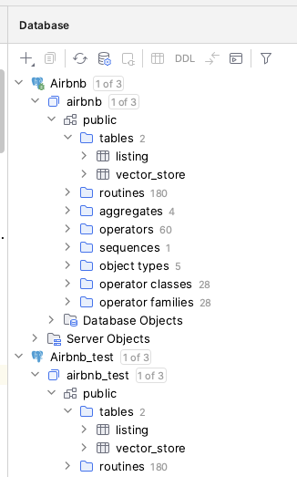

# Spring AI Lab

This project configures two LLMs, Llama3 on the Ollama Platform and OpenAI, controlled with Maven and Spring profiles.

# Audience

The audience or this Spring Framework application developers new to artificial intelligence.

# Use Cases

Your employer asks you to:
- Improve Customer Service by combining augmenting the company Knowledge base with AI.
- Speed up the sales process by combining AI with a database of previously written Statements of work.
- Improve coding efficiency and consistency by leveraging existing company code repositories and AI.
- Host a private LLM so employees can use take advantage of AI privately, without transmitting sensitive company or client data over the public internet.

You probably see a trend here. As a Spring Developer, you may be asked to add AI to your Spring application that augments an open source large language model with proprietary company data. These are the situations where Spring AI can help.

## Getting Started
The purpose of this project is to dip your toes into the AI waters, and you'll need realistic expectations about performance.

### What about GPUs?
The good news is that you can do this lab without a GPU as long as you have patience.

[Meta's Lama 3 Requirements](https://llamaimodel.com/requirements/) say you can get by with an NVidia GeForce RTX 3000 series GPU, which has about 12 GB RAM. NLP Cloud's article [How to Install and Deploy LLaMA 3 Into Production?](https://nlpcloud.com/how-to-install-and-deploy-llama-3-into-production.html) recommends 20 GB RAM on the GPU, like an NVidia A10, for production use.

## Preconditions

This project demonstrates a few different concepts, and as a result, it has a few prerequisites.

### 1) PostgreSQL

PostgreSQL is used as the vector database for the project. To run the project, install PostgreSQL with the PGVector extension.

Next, create two databases:
- airbnb—This is the database the REST API connects to for `mvn spring-voot:run`.
- airbnb_test—Since the Airbnb Listing model uses a vector column, and the H2 database doesn't support the vector column type, this project uses PostgreSQL for Junit tests too.



You'll need to set up the username and password for the Airbnb databases. I used Homebrew to install PostgreSQL on my Macbook, so it used my MaxOS username. Normally, the username is "postgres." Next, I set the password for my PostgreSQL username.

### 2) Ollama

For this lab we are running LLMs on a Docker image of [Ollama](https://ollama.com/). Ollama is not meant to be used in production.

Ollama is an open source platform for running LLMs (Large Language Models) locally. It makes it easier to get started with AI by hiding the complexities of running an LLM.  Choose the best runtime option for your situation. You can download the [Ollama Docker image](https://hub.docker.com/r/ollama/ollama), or you can [download the binary to your operating system](https://ollama.com/download/).

Ollama supports many different LLMs. Visit the [Ollama models page](https://ollama.com/library) for the list of supported LLMs, ranked by popularity.


For this example, we will use [Meta's llama 3](https://llama.meta.com/llama3/).

Run these commands to get started.

```Shell
docker pull ollama/ollama
docker run -d -v ollama:/root/.ollama -p 11434:11434 --name ollama ollama/ollama
docker exec -it ollama ollama run llama3
```

The last command above installs llama3 on your Ollama Docker container and starts an interactive terminal. Spring AI will call the Ollama API, but you can test the command line now.

```shell
>>> tell me a joke
Here's one:

Why couldn't the bicycle stand up by itself?

(wait for it...)

Because it was two-tired!

Hope that made you smile! Do you want to hear another?

>>>/bye
```
You can install more than one LLM on Ollama, but I filled up my Docker volume when I tried.

```shell
docker exec -it ollama ollama run mixtral:8x22b
pulling manifest
pulling d0eeef8264ce...  61% ▕███████████████████████████████████                       ▏  48 GB/ 79 GB   27 MB/s  18m36s
Error: write /root/.ollama/models/blobs/sha256-d0eeef8264ce10a7e578789ee69986c66425639e72c9855e36a0345c230918c9-partial: no space left on device
```
One last check before moving on to Spring AI, you can confirm that the Ollama API is ready by navigating to the [Ollama API URL](http://localhost:11434) in a web browser. It returns the text "Ollama is running."

### 3) OpenIA

In addition to running LLM models locally on Ollama, this project also demonstrates connecting to the OpenAPI key, so create an OpenAI API Key.

### 4) Set your environment variables.

Before using the command `mvn spring-boot run` in a terminal, you must export the variables needed by the `application.yml` file:

```shell
export DB_USER=my-postgres-username
export DB_PASSWORD=my-postgres-password
export OPENAI_API_KEY=my-openai-api-key
```

Likewise, to run the JUnit tests, you need to add the environment variables to the runtime configuration in your IDE. I'm using Intellij.


## Project Testing

You should now be able to execute the unit test from your IDE, or from the command line. If using the command line, be sure to export the environmental variables in your terminal.

```shell
export DB_USER=my-postgres-username
export DB_PASSWORD=my-postgres-password
export OPENAI_API_KEY=my-openai-api-key

mvn clean test
```

## Spring Boot Execution

Spring Boot also needs the environment variables exported to in the terminal or added to your IDE's runtime configuration.

The default Maven profile is "ollama," and the default Spring profile is "llama3," so if that is all you need, then a simple `mvn spring-boot:run` is all you need.
```shell
# Default Maven profile is "ollama" and the default Spring profile is "llama3"
mvn spring-boot:run 
```

If you want to use OpenAI, then you must set the Maven profile to "openapi" and Spring profile to "gpt-40."

```shell
# Sets Maven profile to "openapi" and spring profile to "gpt-40"
mvn -Popenai -spring-boot:run -Dspring-boot.run.jvmArguments="-Dspring.profiles.active=gpt-4o"
```

## Spring AI
Next, set up a Spring AI project, starting with Java, Maven and an IDE.

### Java JVM
Grab the latest version of Java. [SDK Man](https://sdkman.io/) is the easiest way to switch around SDK versions.

```Shell
sdk install java 22.0.1-tem
sdk use java 22.0.1-tem
```

### Spring AI Library
Use [Spring Initializr](https://start.spring.io) to create a project with the dependencies shown below:


