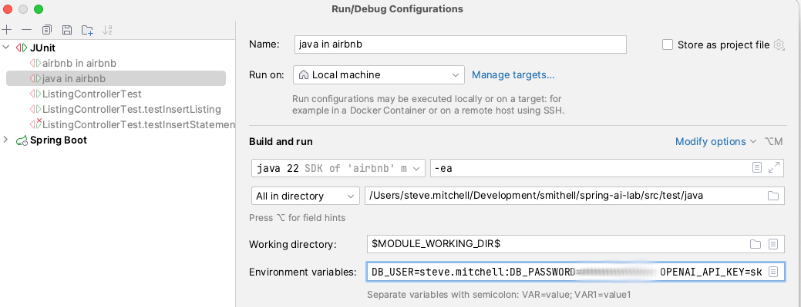

# Spring AI Lab
#### https://github.com/ByteworksHomeLab/spring-ai-lab
This project is an introduction to Spring AI. It demonstrates running two LLMs, Llama 3 on the Ollama platform and OpenAI, using a combination of Maven profiles and Spring 
profiles to switch back and forth.

The project relies on Docker for simplicity.


JUnit tests use Docker Test Containers to dynamically spin up Postgres PGVector. The Spring Boot AI application spins up Docker Compose automatically when it runs providing both Ollama and Postgres PGVector. 
The only thing not automated is the installation of the Llama3 LLM, but that is a one-time task (unless the Docker volume gets deleted).

## Audience
The audience or this project is Spring Framework application developers who are new to artificial intelligence. It is expected that you know your way around the Spring Framework, 
but we don't assume any AI experience.

## Use Cases
Your employer asks you to:
- Improve your Spring Customer Service App by combining the company's Knowledge base with a natural language AI interface.
- Help Sales and Marketing by enhances your Spring sales application with natural language searching of company marketing material.
- Improve coding efficiency and consistency by embedding existing company code repositories with AI for code generation.
- Host a private LLM (Large Language Model) so employees can use take advantage of AI internally, without transmitting sensitive company or client data over the public internet.

You probably see a trend here. As a Spring Developer, you may be asked to add AI to your Spring application that augments an opensource large 
language model with proprietary company data. These are the situations where Spring AI can help.

## Getting Started
The purpose of this project is to dip your toes into the AI waters, and you'll need realistic expectations about performance.

### What about GPUs?
The good news is that you can do this lab without a GPU as long as you have patience. Performance is terrible on my 2019 Intel Macbook Pro, 
but AI response time is tolerable on my M1 MacBook Pro.

[Meta's Lama 3 Requirements](https://llamaimodel.com/requirements/) say you can get by with an NVidia GeForce RTX 3000-series GPU, which has about 12 GB RAM. 
This NLP Cloud's article [How to Install and Deploy LLaMA 3 Into Production?](https://nlpcloud.com/how-to-install-and-deploy-llama-3-into-production.html) recommends 20 GB RAM on the GPU, like an NVidia A10, for production use. 

My 10-year-old home lab workstations didn't justify an expensive GPU, so I picked up an Nvidia GeForce 1080 for $120 on eBay, 
and it performs great in my home lab.

## Preconditions

This project demonstrates a few different concepts, and as a result, it has a few prerequisites.

### 1) Java

This project is using Java 22, but a lower version of Java should work too if you update the Java version in the `pom.xml` file. [SDK Man](https://sdkman.io/) is the 
easiest way to switch around SDK versions:

```Shell
sdk install java 22.0.1-tem
sdk use java 22.0.1-tem
```

### 2) Maven

This project was built using Maven 3.9.8, but any recent version of Maven will be fine.


### 3) PostgreSQL

PostgreSQL is used as the vector database for the project. Specifically, we are using the PGVector Docker image that includes vector database support.
PGVector is defined in the `docker-compose.yaml` at the root of the project.

### 4) Ollama

[Ollama](https://ollama.com) is an opensource platform for running LLMs locally. It makes it easier to get started with AI by hiding the complexities
of running a LLM (Large Language Model). Choose between the [Ollama Docker image](https://hub.docker.com/r/ollama/ollama), or [download the binary to your operating system](https://ollama.com/download/).

Ollama is defined in the `docker-compose.yaml` at the root of the project.

Ollama supports many different LLMs. Visit the [Ollama models page](https://ollama.com/library) for the list of supported LLMs, ranked by popularity.

 

For this example, we will use [Meta's llama 3.1:8b](https://ollama.com/library/llama3.1). 

### 5) OpenAI

In addition to running LLM models locally, this project demonstrates connecting to the OpenAI API. For that, you'll need to create an OpenAI API Key. You can start with a free 
OpenAI account. Later, when you bump up against rate limiting, you can upgrade to a pay-as-you-go account. 

[Here is the link to create an OpenAI API key](https://platform.openai.com/settings/profile?tab=api-keys). Be sure to save the API Key somewhere safe when you create it. 
We'll use it in an environment variable below.

### 6) Set your environment variables.

You must first export the variables needed by the [docker-compose.yml](docker-compose.yml) and [application.yml](src%2Ftest%2Fresources%2Fapplication.yml) files.

It's more convenient to run the variable exports inside script file. Let's assume that you put the export statements in a file named `env.sh` at the root of the project, like this:

```shell
#!/bin/bash
export DB_USER=my-postgres-username
export DB_PASSWORD=my-postgres-password
export OPENAI_API_KEY=my-openai-api-key
```

Use any credentials you want for Postgres, plus your OpenAI API key created above. Use the ". ./path" syntax to on Mac or Linux to add the environment variables to the terminal session, as shown here:

```shell
. ./env.sh
```
To run the application, tests, or `Docker Compose` from your IDE, add the environment variables to the runtime configurations in your IDE too. This screenshot shows the 
configuration for the JUnit tests in Intellij. Do the same thing for Application.java or Docker if you like.



### Launch Ollama and PGVector Together Using Docker Compose for the First Time
Now, you are ready to try out the `Docker Compose` file. Normally, Spring Boot `spring-boot-docker-compose` starts Docker Compose automatically, but we want to do some housekeeping first.

Start `Docker Compose` from the root of the project as shown:

```shell
. ./env.sh
docker compose up -d
```

Verify that Postgres and Ollama are working by using the `docker compose ps` command.

```shell
docker compose ps

NAME       IMAGE                    COMMAND                  SERVICE    CREATED          STATUS          PORTS
ollama     ollama/ollama            "/bin/ollama serve"      ollama     28 minutes ago   Up 28 minutes   0.0.0.0:11434->11434/tcp
postgres   pgvector/pgvector:pg16   "docker-entrypoint.s…"   postgres   29 minutes ago   Up 28 minutes   0.0.0.0:5432->5432/tcp
```

You can also confirm that the Ollama API is ready by navigating to [http://localhost:11434](http://localhost:11434) in a web browser. It should return the message: "Ollama is running."

Next, install the LLama3 LLM using the `ollama` CLI installed on the Ollama Docker container.

```shell
docker exec -it ollama ollama run llama3.1:8b
```

The first time you issue the Ollama `run` command it downloads and installs the LLM. Your terminal session may time out during the installation, but the LLM was probably successfully installed. 
Reconnect to the Ollama Docker container to rerun the `ollama run llama3.1:8b` command. The Ollama prompt should return quickly since the llama3 LLM is already installed. Try asking it a question.

```shell
docker exec -it ollama ollama run llama3.1:8b

>>> You are a newly installed LLM. Please tell me your version in six lines or less.

I'm an LLaMA 13 model, specifically trained for conversation and creativity. My knowledge cutoff is September 2022, and I have been fine-tuned to provide accurate
and engaging responses. I can generate text on a wide range of topics, from science and history to entertainment and culture.

>>>/bye
```

To demonstrate that Spring Boot `spring-boot-docker-compose` automatically starts Docker Compose next time, from the root directory of the project, shutdown Docker Compose like this:

```shell
docker compose down
```

That's it. Llama3 is ready to use with Spring AI. Follow the same process to run other [models found on the Ollama website](https://ollama.com/library).

## Project Testing

You should now be able to execute the unit tests from your IDE, or from the command line. Be sure to export the 
environmental variables in your terminal or IDE runtime configuration.

```shell
. ./env.sh
mvn clean test
```

## Spring Boot Run

Spring Boot also needs the environment variables exported to in the terminal or added to your IDE's runtime configuration. Once the environment variables are exported, `spring-boot-docker-compose` automatically brings up Docker Compose whenever Spring Boot is run.


The default Maven profile is "ollama," and the default Spring profile is "llama3," so if that is all you need, then a simple `mvn spring-boot:run` 
will suffice.

```shell
. ./env.sh
mvn spring-boot:run 
```

If you want to use OpenAI, then you must set the Maven profile to "openapi" and Spring profile to "gpt-4o."

```shell
. ./env.sh
mvn -Popenai spring-boot:run -Dspring-boot.run.jvmArguments="-Dspring.profiles.active=gpt-4o"
```

## Spring AI
Okay, now that you know how to run everything in this [GitHub project](https://github.com/ByteworksHomeLab/spring-ai-lab), it's your turn to set up your own Spring AI project.

### Spring AI Library
Use [Spring Initializr](https://start.spring.io) to create a project with the dependencies shown below:


### Set up the Application Properties

A full [application.yml](src%2Fmain%2Fresources%2Fapplication.yml) file is included in this project. A bare-bones properties file for Ollama might look like this.

```yaml
spring:
  application:
    name: spring-ai-airbnb
  ai:
    ollama:
      base-url: http://localhost:11434
      chat:
        model: llama3.1:8b
```

Here is a bare-bones properties file for Ollama3.

```yaml
spring:
  application:
    name: spring-ai-airbnb
  ai:
    openai:
      api-key: ${OPENAI_API_KEY}
      chat:
        options:
          model: gpt-4o
```

This project uses Spring profiles to control which properties are loaded. It also uses Maven profiles in the [pom.xml](pom.xml) file to control which dependencies are loaded.


