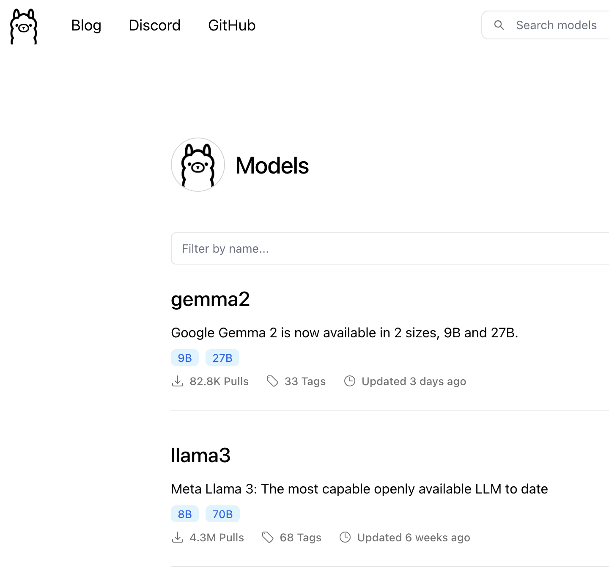
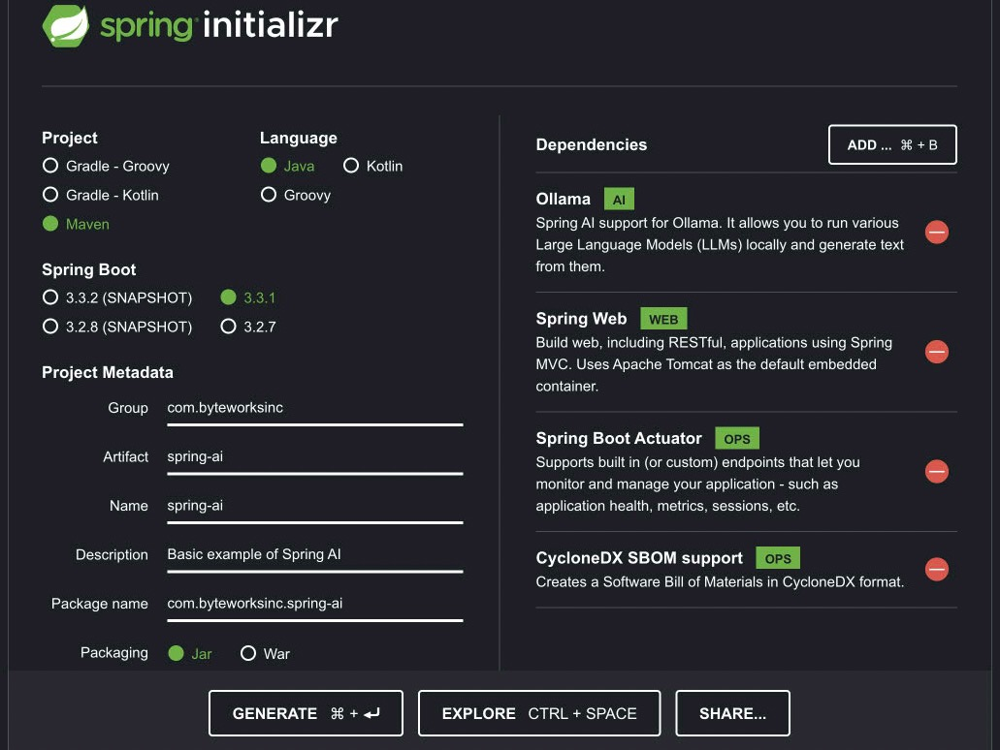

#Spring AI

The project is based on work by [DaShaun Carter](linkedin.com/in/dashaun) See the DaShaun's
video ["A Tiny Taste of Spring AI with Ollama"](https://www.linkedin.com/video/live/urn:li:ugcPost:7213736555662753792/).

## Getting Started

### Ollama LLM Platform

[Ollama](https://ollama.com/) is an open source platform for running LLMs (Large Language Models) locally. It makes it easier to get started with AI by hidiong the complexities of running an LLM.  Choose the best runtime option for your situation. You can download the [Ollama Docker image](https://hub.docker.com/r/ollama/ollama), or you can [download the binary to your operating system](https://ollama.com/download/).

Ollama is not an LLM, it is plaform on which you can run LLMs. Visit the [Ollama models page](https://ollama.com/library) for the list of supported models, ranked by popularity. 



For this example, we will use [Meta llama 3](https://llama.meta.com/llama3/) and [Mistral 7B](https://mistral.ai/technology/#models).

If running the Ollama Docker image, follow these commands:

```Shell
docker pull ollama/ollama
docker run -d -v ollama:/root/.ollama -p 11434:11434 --name ollama ollama/ollama
docker exec -it ollama ollama run llama3
```

The last command above installs llama3 on your ollama Docker container and starts an interactive terminal. Spring AI will call the Ollama API, but you test the command line now.

```shell
>>> tell me a joke
Here's one:

Why couldn't the bicycle stand up by itself?

(wait for it...)

Because it was two-tired!

Hope that made you smile! Do you want to hear another?

>>>/bye
It was nice sharing a joke with you. If you ever want to hear another or chat about something else, feel free to
come back and I'll be here! Otherwise, it's been a pleasure, and I bid you adieu!
```
Next, install and run mixtral.

```Shell
docker exec -it ollama ollama run mixtral:8x22b
````

Use the same prompt as above to see the difference.

### Java JVM

Grab the latest version of Java. [SDK Man](https://sdkman.io/) is the easest way to switch around SDK versions.

```Shell
sdk install java 22.0.1-tem
sdk use java 22.0.1-tem
```

### Spring AI Project

Use [Spring Initializr](https://start.spring.io) to create a project with the dependencies shown below:


