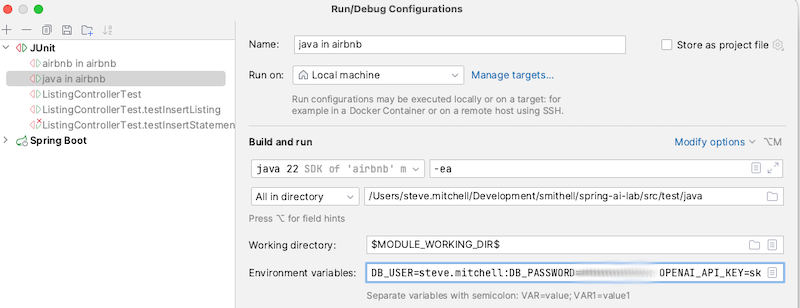

# Spring AI Lab

Do you want to make your Java apps smarter? This lab will help. It shows you how to add cool AI features to your Java projects using the Spring 
framework. It's perfect for beginners who want to start using AI.

It covers the following:
• Simple Chatbots: Learn how to build basic chatbots that can talk to users using Spring Boot.
• Smart Answers with AI: Discover how to create apps that give better answers by combining search with AI tools.
• Vector Databases: Find out how to use special databases that help AI apps handle lots of information quickly.
• AI Workflows: See how to set up workflows that let your apps do complex tasks on their own.

By the end, you’ll have the skills and examples you need to start using AI in your Spring apps. Learn how to make your Java projects even more amazing with AI!


## Audience
The audience or this project is Spring Framework application developers who are new to artificial intelligence. It is
expected that you know your way around the Spring Framework, but we don't assume any AI experience.

Have a look at [Spring In Action](https://livebook.manning.com/book/spring-ai-in-action/) for even more information on Spring AI.


## Overview

This project is an introduction to Spring AI. It demonstrates running three LLMs (Large Language Models):
- Llama3 locally on the Ollama platform
- Groq in the cloud
- ChatGPT in the cloud

The project uses a combination of Maven profiles and Spring profiles to switch between the LLMs without having to change
any Java code.

__At the end of this README file, you'll learn how to get up and running with OpenAI in less than 15 minutes__.

## Use Cases
Your employer asks you to:
- Improve your Spring Customer Service App by combining the company's Knowledge base with a natural language AI interface.
- Help Sales and Marketing by enhances your Spring sales application with natural language searching of company marketing material.
- Improve coding efficiency and consistency by embedding existing company code repositories with AI for code generation.
- Host a private LLM so employees can use take advantage of AI internally, without transmitting sensitive company or client data over the public internet.

You probably see a trend here. As a Spring Developer, you may be asked to add AI to your Spring application that augments 
an opensource large language model with proprietary company data. These are the situations where Spring AI can help.

## Getting Started
The purpose of this project is to dip your toes into the AI waters. We'll demonstrate using Spring AI calling OpenAI and 
Groq via their respective APIs, so you'll need to sign up for free API keys from both. Also, we'll install Ollama to run 
the Llama3 LLM locally. Ollama is to LLMs what VirtualBox is to virtual machines or Docker Desktop to containers, but instead
of running virtual machines or containers, Ollama runs LLMs. One caveat is that you'll need realistic expectations about local LLM performance.

### What about GPUs?
AI does lots of parallel vector math, and GPUs handle lots of parallel processes to render displays, which is why they go well together.
The good news is that you can do this lab without a GPU as long as you have patience, although, for longer term use, you'll want a GPU. 
Ollama supports Nvidia and AMD GPUs. See the [Ollama GPU Documentation page](https://github.com/ollama/ollama/blob/main/docs/gpu.md).

## Preconditions

This project demonstrates a few different concepts, and as a result, it has a few prerequisites.

### 1) Java

This project is using Java 22, but a lower version of Java should work too if you update the Java version in the `pom.xml`
file. [SDK Man](https://sdkman.io/) is the easiest way to switch around SDK versions:

```Shell
sdk install java 22.0.1-tem
sdk use java 22.0.1-tem
```

### 2) Maven

This project was built using Maven 3.9.8, but any recent version of Maven will be fine.

### 3) PostgreSQL

PostgreSQL is used as the vector database for the project. Specifically, we are using the PGVector Docker image that 
includes vector database support. PGVector is defined in the `docker-compose.yaml` file at the root of the project.

### 4) Ollama

[Ollama](https://ollama.com) is an opensource platform for running LLMs locally. It makes it easier to get started with AI by hiding 
the complexities of running a LLM (Large Language Model). Choose between the [Ollama Docker image](https://hub.docker.com/r/ollama/ollama), or 
[downloading the binary to your operating system](https://ollama.com/download/).

Ollama is also defined in the `docker-compose.yaml` file at the root of the project.

Ollama supports many different LLMs. Visit the [Ollama models page](https://ollama.com/library) for the list of supported LLMs, ranked by popularity.

For this example, we will use [Meta's llama 3.1](https://ollama.com/library/llama3). 

### 5) OpenAI

In addition to running LLM models locally, this project demonstrates connecting to the OpenAI API. For that, you'll need 
to create an OpenAI API Key. You can start with a free OpenAI account. Later, when you bump up against rate limiting, 
you can upgrade to a pay-as-you-go account. 

[Here is the link to create an OpenAI API key](https://platform.openai.com/settings/profile?tab=api-keys). Be sure to save the API Key somewhere safe when you create it.

### 6) Groq

This project demonstrates connecting to the Groq API too. You'll need to create a Groq API Key. 

[Here is the link to create a Groq API key](https://console.Groq.com/keys). Be sure to save the API Key.

### 7) Set your environment variables.

You need to export variables into your terminal or IDE runtime environment. The [docker-compose.yml](docker-compose.yml) and [application.yml](src%2Ftest%2Fresources%2Fapplication.yml) 
files both need environment variables to be set.

It's more convenient to run the variable exports inside a script file. Put the export statements in a file named `.env` 
at the root of the project, like this:

```shell
#!/bin/bash
export DB_USER=my-postgres-username
export DB_PASSWORD=my-postgres-password
export DB_HOST=localhost
export DATABASE_NAME=airbnb
export OLLAMA_HOST=localhost
export OPENAI_API_KEY=my-openai-api-key
export GROK_API_KEY=my-grok-api-key
echo "Environment variables set"
```

Use any credentials you want for Postgres, plus the Groq and OpenAI API keys created above. The `gitignore` file already
contains and entry for a file named `.env.` Use the ". ./.env" syntax on Mac or Linux to add the environment variables 
to the terminal session, as shown here:

```shell
. ./.env
```
To run the application, tests, or `Docker Compose` from your IDE, add the environment variables inside the IDE runtime 
configurations too. This screenshot shows the configuration for the JUnit tests in Intellij. Do the same 
thing for Application.java or Docker if you like.



### Launch Ollama and PGVector Together Using Docker Compose for the First Time
Now, you are ready to try out the `Docker Compose` file. Normally, running Spring Boot starts Docker Compose automatically 
because of the `spring-boot-docker-compose` library, but we want to do some housekeeping first.

Start `Docker Compose` from the root of the project as shown:

```shell
. ./.env
docker compose up -d
```

Verify that Postgres and Ollama are working by using the `docker compose ps` command.

```shell
docker compose ps

NAME       IMAGE                    COMMAND                  SERVICE    CREATED          STATUS          PORTS
ollama     ollama/ollama            "/bin/ollama serve"      ollama     28 minutes ago   Up 28 minutes   0.0.0.0:11434->11434/tcp
postgres   pgvector/pgvector:pg16   "docker-entrypoint.s…"   postgres   29 minutes ago   Up 28 minutes   0.0.0.0:5432->5432/tcp
```

You can also confirm that the Ollama API is ready by navigating to [http://localhost:11434](http://localhost:11434) in a web browser. 
It should return the message: "Ollama is running."

First, install an embedding model using the `ollama` CLI installed on the Ollama Docker container. We'll cover that late, though:

```shell
docker exec -it ollama ollama pull all-minilm
```

Next, install the LLama3 LLM 

```shell
docker exec -it ollama ollama run llama3.1:8b
```

The first time you issue the Ollama `run` command it downloads and installs the LLM. Your terminal session may time out during the installation, but the LLM was probably successfully installed.
Reconnect to the Ollama Docker container to rerun the `ollama run llama3.1:8b` command. The Ollama prompt should return quickly since the llama3 LLM is already installed. Try asking it a question.

```shell
docker exec -it ollama ollama run llama3

>>> You are a newly installed LLM. Please tell me your version in six lines or less.
I’m excited to share!
My version is Meta AI’s LLaMA, the latest Large Language Model.
I’m built on top of the Transformers library and trained on a massive dataset of text from the internet.
My training data includes a wide range of texts, from books and articles to social media posts and more.
I’ve been fine-tuned for conversational dialogue and can understand and respond to natural language inputs.
I’m still learning and improving every day, but I’m ready to chat with you!
>>> /bye
```

These are all the commands for the Ollama CLI:
```
Available Commands:
  serve       Start ollama
  create      Create a model from a Modelfile
  show        Show information for a model
  run         Run a model
  pull        Pull a model from a registry
  push        Push a model to a registry
  list        List models
  ps          List running models
  cp          Copy a model
  rm          Remove a model
  help        Help about any command
```

In the steps above, you pulled an embedding model, `all-minilm`. Ollama supports [three embedding models](https://ollama.com/blog/embedding-models).

| Embedding Model                                                   | Parameters   |
|-------------------------------------------------------------------|--------------|
| [mxbai-embed-large](https://ollama.com/library/mxbai-embed-large) | 334M         |
| [nomic-embed-text](https://ollama.com/library/nomic-embed-text)   | 137M         |
| [all-minilm](https://ollama.com/library/all-minilm)               | 23M          |

Whenever you change the embedding model, follow these steps. We've already made these changes for the `all-minilm` embedding model.

1) __Pull the Embedding Model__—Use the Ollama CLI to pull down the embedding model that you select. For instance, `docker exec -it ollama ollama pull all-minilm`.
2) __Update the Ollama Embedding Model Property__—Update `spring.ai.ollama.embedding.model` to specify the new embedding model.
3) __Update the Vector Store Dimensions__—Update `spring.ai.vectorstore.pgvector.dimensions` to match the new embedding model.
4) __Drop the Vector Storage Table__—Run `DROP TABLE` on the vector storage table.

Stop the application and shutdown Docker Compose before performing these steps. The next time your run the Spring Boot application it will automatially 
recreate the vector_store table.

```shell
docker compose down
```

#### 1) Pull the Embedding Model
Here is a detailed review of the steps above for your future reference.

Use the `ollama pull` command to pull down the embedding model.

```shell
docker exec -it ollama ollama pull all-minilm
```

#### 2) Update the Ollama Embedding Model Property—Update
Update `spring.ai.ollama.embedding.model` to specify the new embedding model.

```yaml
spring:
  ai:
    ollama:
      base-url: http://${OLLAMA_HOST}:11434
      chat:
        options:
          model: llama3.1:8b
      embedding:
        enabled: true
        model: all-minilm
```

### 3) Update the Vector Store Dimensions
Update `spring.ai.vectorstore.pgvector.dimensions` to match the new embedding model. If it doesn't match, you will get 
an error. That is how I knew what dimensions to use (384 dimensions) after switching the embedding model to `all-minilm.`

```yaml
spring:
  ai:
    vectorstore:
      pgvector:
        index-type: hnsw
        dimensions: 384
        distance-type: cosine_distance
```

### 4) Drop the Vector Storage Table
Connect to the airbnb database in PostgreSQL and locate the `vector_table`, then drop it.

```sql
DROP TABLE vector_store;
```

You don't need to recreate the vector storage table. Spring Boot AI recreates the vector database the next time you 
do a `mvn spring-boot-run` based on the application properties above.

## Project Testing

You should now be able to execute the unit tests from your IDE, or from the command line. Be sure to export the 
environmental variables in your terminal or IDE runtime configuration first.

```shell
. ./.env
mvn clean test
```

## Spring Boot Run

Spring Boot also needs the environment variables exported to in the terminal or added to your IDE's runtime configuration. 
Once the environment variables are exported, `spring-boot-docker-compose` automatically brings up Docker Compose whenever 
Spring Boot is run.


If you load all 15,000 listings once, the listings won't be reloaded, as long as you don't delete the Postgres volume. 
If you don't want to load call 15,000 Airbnb listings to avoid the 1-hour load, backup src/main/resources/data/listings.csv, 
then remove as many Airbnb listings from `listings.csv` as you want. 

### Picking Maven and Spring Profiles to Run

The default Maven profile is "ollama," and the default Spring profile is "llama3," so if that is all you need,
simply run `mvn spring-boot:run.`

```shell
. ./.env
mvn spring-boot:run 
```
The output should look like this:


If you want to use OpenAI, then you must set the Maven profile to "openapi" and Spring profile to "gpt-4o."

```shell
. ./.env
mvn -Popenai spring-boot:run -Dspring-boot.run.jvmArguments="-Dspring.profiles.active=gpt-4o"
```

If you want to use Groq, then you must set the Maven profile to "openapi" and Spring profile to "groq."

```shell
. ./.env
mvn -Popenai spring-boot:run -Dspring-boot.run.jvmArguments="-Dspring.profiles.active=groq"
```

## Vector Embedding

At this point, the project should be running, but the vector database is empty. There is a CSV file with 15,000 Airbnb listings from Austin, TX.
These need to run through the embedding model and written to the `vector_table`. A `/run-ingestion` was added as a convenient way to do the embedding.
It takes about an hour to run, depending on your hardware. With the Spring Boot application running, paste this URL in your browser:

```shell
http://localhost:8080/run-ingestion
```

Messages like these will start appearing in the Spring Boot console output:

```shell
2024-08-18T19:54:53.398-05:00  INFO 13846 --- [spring-ai-airbnb] [oundedElastic-2] o.s.a.transformer.splitter.TextSplitter  : Splitting up document into 2 chunks.
2024-08-18T19:54:53.762-05:00  INFO 13846 --- [spring-ai-airbnb] [oundedElastic-2] o.s.a.transformer.splitter.TextSplitter  : Splitting up document into 2 chunks.
2024-08-18T19:54:55.383-05:00  INFO 13846 --- [spring-ai-airbnb] [oundedElastic-2] o.s.a.transformer.splitter.TextSplitter  : Splitting up document into 2 chunks.
```

Use SQL to verify the results:

```sql
select count(*) from vector_store;
```

There should be 16,249 rows in the vector table.

To see the embedding value, run this query:

```sql
select content, embedding from vector_store limit 10;
```

# Build your own Spring AI Project from Scratch using OpenAI in under 10-minutes
Okay, now that you know how to run everything in this [GitHub project](https://github.com/ByteworksHomeLab/spring-ai-lab), it's your turn to set up your own Spring AI 
project. This will take less than 10 minutes.

## Spring AI Library
Use [Spring Initializr](https://start.spring.io) to create a project with the dependencies shown below. To keep it simple, we'll start with 
just OpenAPI and Spring Web.


## Set up the Application Properties

Paste these bare-bones properties file for ChatGPT into the `application.yml` file.

```yaml
spring:
  application:
    name: demo
  ai:
    openai:
      api-key: ${OPENAI_API_KEY}
      chat:
        options:
          model: gpt-4o
```

Next, add a REST endpoint.

```shell
import org.springframework.ai.chat.client.ChatClient;
import org.springframework.web.bind.annotation.GetMapping;
import org.springframework.web.bind.annotation.RequestParam;
import org.springframework.web.bind.annotation.RestController;

@RestController
public class ChatController {
    
    private final ChatClient chatClient;

    public ChatController(final ChatClient.Builder builder) {
        this.chatClient = builder.build();
    }
    
    @GetMapping("/")
    public String prompt(@RequestParam(value = "message", defaultValue = "Tell me a dad joke") String message) {
        return chatClient.prompt()
                .user(message)
                .call()
                .content(); // short for getResult().getOutput().getContent();
    }
}
```

That is all you need to get started. Make sure the unit test runs, then start the project and use ChatGPT.

1) Run ` . ./.env`
2) Run `mvn spring-boot:run`.
2) Open http://localhost:8080?message=You are a Spring Developer Advocate. Tell me about Spring AI. Use HTML for the response.

Next, take a look at this project and experiment with other features like Ollama and a vector database. Have fun!


